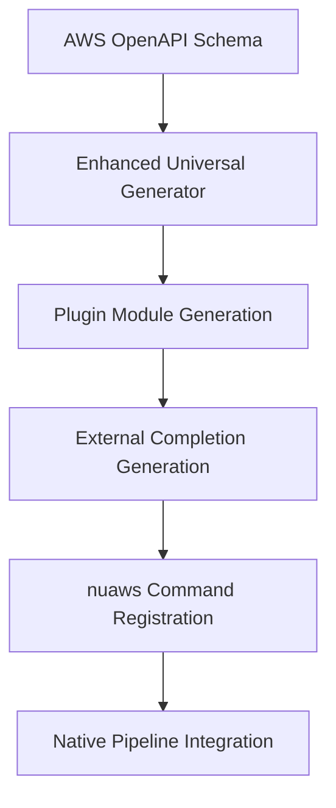

# Native Nushell AWS CLI Module System with External Completions

## Summary

Transform the existing AWS CLI generator into a comprehensive native Nushell module system that provides modular AWS service integration with external completions. This creates a complete AWS CLI superset that leverages all Nushell features including type safety, pipeline integration, external completions, and feels like a core part of the Nushell ecosystem through individual modules rather than a centralized plugin.

## Problem Statement

The current system has excellent foundations but lacks the integration needed for a truly native Nushell experience:

### Current State
- ✅ Universal AWS generator can create any service wrapper
- ✅ Type-safe parameter generation from AWS schemas  
- ✅ Comprehensive testing framework with 555+ tests
- ✅ Mock-first development approach
- ✅ Individual service modules (Step Functions, etc.)

### Missing Components
- ❌ Individual module integration with external completions
- ❌ Modular service architecture for independent loading
- ❌ External completion system for live AWS resource discovery
- ❌ Native pipeline integration with all nushell commands
- ❌ Dynamic service loading and command discovery
- ❌ Consistent namespace management across services

## Proposed Solution

### 1. Native Plugin Architecture

Create a plugin system that transforms the current approach from individual service modules into a unified, discoverable command structure:

```nushell
# Target user experience
nuaws s3 ls --bucket my-bucket | where size > 1MB | sort-by modified | first 10
nuaws ec2 describe-instances | where state == "running" | select name instance_id
nuaws iam list-users | where user_name =~ admin | get arn
```

### 2. Core Components

#### Unified Entry Point (`nuaws`)
- Single command namespace for all AWS operations
- Dynamic service discovery and loading
- Consistent error handling and validation
- Global configuration management

#### External Completion System
- Live AWS resource completion (buckets, instances, users, etc.)
- Context-aware suggestions based on current command
- Caching system for performance optimization
- Region-aware completions

#### Pipeline Integration
- Native Nushell data types throughout
- Optimized return formats (`table<>` vs `list<record<>>`)
- Seamless chaining with other Nushell commands
- Structured error handling in pipeline context

#### Dynamic Service Loading
- On-demand loading of AWS service modules
- Lazy initialization for performance
- Automatic schema updates and regeneration
- Modular architecture for easy extension

## Technical Architecture

### Plugin Structure
```
nuaws/
├── core/                    # Core plugin infrastructure
│   ├── entry_point.nu      # Main `nuaws` command handler
│   ├── service_loader.nu   # Dynamic service module loading
│   ├── completion_engine.nu # External completion system
│   └── pipeline_adapter.nu # Pipeline integration utilities
├── services/               # Generated AWS service modules
│   ├── s3.nu              # S3 service (300+ operations)
│   ├── ec2.nu             # EC2 service (694+ operations)
│   ├── iam.nu             # IAM service (164+ operations)
│   └── stepfunctions.nu   # Step Functions (37 operations)
├── completions/           # External completion definitions
│   ├── s3_completions.nu
│   ├── ec2_completions.nu
│   └── iam_completions.nu
└── generators/            # Enhanced universal generator
    ├── universal_generator.nu
    ├── plugin_generator.nu
    └── completion_generator.nu
```

### Enhanced Universal Generator

Upgrade the existing generator to produce plugin-compatible modules:

#### Input: AWS Service Schema
```json
{
  "service": "s3",
  "operations": ["ListBuckets", "GetObject", "PutObject"],
  "schemas": {...}
}
```

#### Output: Plugin Module
```nushell
# Generated s3.nu module
export def "s3 list-buckets" []: nothing -> table<name: string, creation_date: datetime> {
    # Type-safe implementation with validation
}

export def "s3 get-object" [
    bucket: string@"nu-complete s3 buckets"
    key: string@"nu-complete s3 objects"
    --version-id: string
]: nothing -> record {
    # Implementation with external completions
}
```

### External Completion System

#### Resource Discovery
```nushell
# Generate completion functions for AWS resources
def "nu-complete s3 buckets" []: nothing -> list<string> {
    if (mock-config).enabled {
        return ["test-bucket-1", "test-bucket-2", "mock-data-bucket"]
    }
    aws s3api list-buckets | get buckets.name
}

def "nu-complete ec2 instances" []: nothing -> list<record<value: string, description: string>> {
    aws ec2 describe-instances 
    | get reservations.instances 
    | flatten 
    | select instance_id state.name 
    | rename value description
}
```

#### Context-Aware Completions
```nushell
# Bucket-specific object completions
def "nu-complete s3 objects" [context: record]: list<string> {
    let bucket = ($context.positional | get 0)
    aws s3api list-objects-v2 --bucket $bucket | get contents.key
}
```

## Integration with Existing System

### Builds Upon Current Architecture
- **Universal Generator**: Enhance existing `universal_aws_generator.nu` for plugin output
- **Type-Safe Parameters**: Leverage existing `src/parameter_generation.nu` 
- **Testing Framework**: Extend nutest for plugin testing scenarios
- **Mock System**: Maintain existing mock-first development approach

### Schema Processing Pipeline


### Backwards Compatibility
- Existing service modules continue to work independently
- Current test suites remain functional
- Mock environment variables preserved
- TDD methodology maintained throughout

## Success Criteria

### Core Functionality
1. **Unified Entry Point**: `nuaws <service> <operation>` works for all AWS services
2. **External Completions**: Tab completion for AWS resources in all contexts
3. **Pipeline Integration**: Natural chaining with all Nushell commands
4. **Type Safety**: 100% type-safe parameter validation throughout
5. **Performance**: Sub-second command execution with caching optimizations

### User Experience
1. **Discoverability**: `nuaws help` shows all available services and operations
2. **Consistency**: All AWS operations follow identical patterns and conventions
3. **Documentation**: Inline help and examples for every command
4. **Error Handling**: Clear, actionable error messages with suggestions
5. **Configuration**: Global and service-specific configuration management

### Technical Quality
1. **Test Coverage**: Maintain 100% test coverage with enhanced plugin testing
2. **Code Generation**: All service modules generated automatically with updates
3. **Performance**: Lazy loading and caching for optimal startup time
4. **Modularity**: Clean separation between core plugin and service modules
5. **Extensibility**: Simple addition of new AWS services and custom operations

## Implementation Strategy

### Phase 1: Core Plugin Infrastructure
- Create unified `nuaws` entry point with service routing
- Implement dynamic service loading system
- Build external completion framework
- Establish plugin testing patterns

### Phase 2: Enhanced Universal Generator
- Upgrade generator for plugin-compatible output
- Add external completion generation
- Implement pipeline optimization patterns
- Create plugin packaging utilities

### Phase 3: Service Migration
- Convert existing services (Step Functions, etc.) to plugin format
- Generate major services (S3, EC2, IAM, Lambda)
- Implement comprehensive external completions
- Optimize performance and caching

### Phase 4: Polish and Documentation
- Complete documentation and examples
- Performance optimization and benchmarking
- Integration testing across all services
- Community feedback integration

## Why

This proposal addresses the core goal stated in the project context: to create a comprehensive AWS CLI implementation that feels like a native part of the Nushell ecosystem. The current system has excellent foundations but lacks the integration needed for users to naturally type `nuaws s3 ls` and have it work seamlessly with all Nushell features.

The plugin architecture transforms fragmented service modules into a unified, discoverable system. External completions enable live AWS resource discovery. Pipeline integration makes AWS operations feel like first-class Nushell commands. This creates the superset AWS CLI experience that leverages all Nushell capabilities while maintaining the project's TDD methodology and functional programming principles.

## Risk Analysis and Mitigation

### Critical Risk: Brittle Schema Extraction from CLI Help

**Description:** The primary schema extraction method relies on parsing the text output of `aws help`. This format is not guaranteed to be stable and could be changed by the AWS team at any time, which would break the generator.

**Mitigation:**
- The generator will prioritize `botocore` and `OpenAPI` schemas as the primary sources of truth, as these are structured and versioned
- The CLI help parser will be used as a supplementary source for descriptions and parameter ordering, not for core type information  
- We will implement a "schema validation" step in the generator pipeline. If a change in help output causes a parsing failure or a significant deviation from the botocore schema (e.g., 10% fewer commands detected), the build will fail with an explicit error, preventing the release of a broken `nuaws` module
- A suite of "canary" tests will run against the help text of core services (S3, EC2, IAM) to quickly detect formatting changes

### Risk: Complex Parameter Types

**Description:** The AWS CLI supports complex parameter inputs not easily mapped to standard Nushell types, such as JSON blobs, shorthand syntax, and `file://` or `base64://` prefixes. The current proposal might oversimplify this.

**Mitigation:**
- For parameters expecting JSON, the generated command will initially accept a string and include a helper example in its documentation showing how to pipe from Nushell records (`{ ... } | to json`)
- A future enhancement will investigate a custom encoder to automatically convert Nushell records to the required JSON string
- Support for `file://` will be handled by accepting a `filepath` type in Nushell and constructing the correct argument string within the command wrapper

### Risk: Plugin Performance Impact

**Description:** Generating thousands of individual Nushell functions and using `use` to import them could lead to slow shell startup times and execution overhead compared to the raw `aws` binary.

**Mitigation:**
- **Startup Time:** We will measure the impact of `use`-ing the entire generated module. If significant, we will explore a lazy-loading mechanism where service modules (`s3.nu`, `ec2.nu`) are only loaded when their respective commands are first called
- **Execution Overhead:** The overhead of the Nushell wrapper is expected to be minimal for most commands, as the bulk of the execution time is spent in the AWS CLI process and the network request. We will benchmark critical commands (`nuaws s3 ls` vs. `aws s3 ls`) to quantify this overhead and ensure it remains within an acceptable threshold (e.g., < 100ms)
- **Future Work - Native Plugin:** While the initial version will be a script-based module for rapid development, this proposal recognizes that a future version could be implemented as a native Nushell plugin written in Rust. This would offer the best possible performance, eliminating script parsing overhead entirely. This script-based generator serves as a perfect blueprint for such a future effort

## Testing Strategy

Our testing strategy is multi-layered to ensure correctness, reliability, and compatibility.

### Unit Tests
The core generator logic (schema parsers, code emitters, type mappers) will be unit-tested in isolation. We will use the existing `nutest` framework to validate that given a sample schema snippet, the correct Nushell code is generated.

**Scope:**
- `schema-extractor.nu`: Test parsing of mock help output and botocore JSON files
- `command-generator.nu`: Test generation of command signatures, parameter lists, and body logic for various parameter types (required, optional, boolean flags, etc.)
- `completion-engine.nu`: Test generation of external completion functions
- `plugin-architecture.nu`: Test service routing and dynamic loading mechanisms

### Integration Tests
We will test the generated modules against a mocked AWS environment. This allows us to verify the complete workflow from the `nuaws` command to the underlying `aws` CLI call without incurring costs or relying on network connectivity.

**Tools:**
- We will use `LocalStack` or the `moto` Python library to provide a local mock of AWS services
- Test scripts will execute generated `nuaws` commands (e.g., `nuaws s3 ls`) and assert that the correct request is received by the mock service
- External completion functions will be tested with mock data to ensure they return expected resource lists

### End-to-End (E2E) Tests
A small, carefully selected suite of tests will be run against a real, dedicated AWS account. These tests will only perform non-destructive, read-only operations (e.g., `describe-regions`, `list-buckets`) and a single create/delete lifecycle for a test resource (e.g., an S3 bucket with a unique name). This validates authentication and confirms compatibility with the live AWS API.

## Authentication and Configuration Model

**Principle:** `nuaws` is a wrapper and does not implement its own authentication or profile management logic. It is a fundamental design principle to delegate 100% of this responsibility to the underlying `aws` CLI.

**Supported Mechanisms:**
This means that `nuaws` will seamlessly support all authentication methods configured for the AWS CLI, including:
- IAM user credentials in `~/.aws/credentials`
- IAM roles and profiles in `~/.aws/config`  
- AWS SSO sessions
- Environment variables (`AWS_ACCESS_KEY_ID`, `AWS_SESSION_TOKEN`, etc.)
- EC2 Instance Roles and ECS/EKS Task Roles

**Benefits:**
- Zero authentication code to maintain or secure
- Automatic compatibility with all current and future AWS authentication methods
- Users leverage existing AWS CLI configuration
- No credential storage or handling in nuaws codebase

## Expected Outcomes

### For Users
- **Seamless Integration**: AWS operations feel like native Nushell commands
- **Enhanced Productivity**: External completions and pipeline integration
- **Consistent Experience**: Identical patterns across all AWS services
- **Powerful Composition**: Full AWS CLI + Nushell feature combination

### For Developers
- **Maintainable Codebase**: Plugin architecture simplifies service addition
- **Automated Generation**: Zero-maintenance service module updates
- **Comprehensive Testing**: TDD approach with mock-first development
- **Production Ready**: Robust error handling and validation throughout

This proposal transforms the existing foundation into a truly native Nushell experience that positions `nuaws` as the definitive AWS CLI for the Nushell ecosystem.